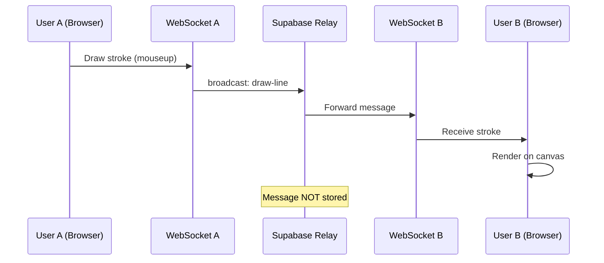

# Lesson 1: Transport Layer - WebSockets, Pub/Sub, and Stateless Relay

## Learning Objectives
By the end of this lesson, you'll understand:
- How WebSockets enable real-time bidirectional communication
- The Pub/Sub (Publish/Subscribe) messaging pattern
- Why we chose a "Stateless Relay" architecture
- How Supabase Realtime implements these concepts

---

## 1. WebSockets vs HTTP

### Traditional HTTP (Request/Response)
```
Client → [HTTP Request] → Server
Client ← [HTTP Response] ← Server
(Connection closes)
```

**Limitations:**
- Client must initiate every request
- Server can't push updates to client
- High latency for real-time updates (polling required)

### WebSockets (Persistent Connection)
```
Client ←→ [WebSocket Connection] ←→ Server
(Connection stays open, bidirectional messages)
```

**Advantages:**
- Server can push messages to client anytime
- Low latency (~10-50ms)
- Efficient for real-time apps

---

## 2. Pub/Sub Pattern

### What is Pub/Sub?

**Publisher** → Sends messages to a **Channel/Topic**  
**Subscribers** → Receive all messages from that channel

```
User A (Publisher) → Channel "room-1" → User B (Subscriber)
                                      → User C (Subscriber)
                                      → User D (Subscriber)
```

### Key Characteristics
- **Decoupled**: Publishers don't know who's listening
- **Broadcast**: One message reaches all subscribers
- **Topic-based**: Multiple channels can exist simultaneously

---

## 3. Our Implementation: Supabase Realtime

### Channel Setup

**File:** `src/hooks/useWhiteboard.ts` (Lines 42-44)

```typescript
useEffect(() => {
  const roomId = new URLSearchParams(window.location.search).get('room') || 'room-1';
  const channel = supabase.channel(roomId);
  
  // Subscribe to the channel
  channel.subscribe(async (status) => {
    if (status === 'SUBSCRIBED') {
      // Connection established, start tracking presence
    }
  });
}, []);
```

**What's happening:**
1. Extract room ID from URL (`?room=room-1`)
2. Create a channel (like a chat room)
3. Subscribe to that channel (join the room)

---

## 4. Broadcast Events (Fire-and-Forget)

### Publishing a Message

**File:** `src/hooks/useWhiteboard.ts` (Lines 189-193)

```typescript
const endDrawing = useCallback(() => {
  setCurrentStroke((prev) => {
    if (prev) {
      // Broadcast the completed stroke
      channelRef.current?.send({
        type: 'broadcast',
        event: 'draw-line',
        payload: prev,  // The stroke object
      });
    }
    return null;
  });
}, []);
```

**What's happening:**
1. User finishes drawing (mouse up)
2. Send stroke to channel via `broadcast`
3. Message goes to **all subscribers** except sender
4. No acknowledgment or response expected

### Receiving a Message

**File:** `src/hooks/useWhiteboard.ts` (Lines 53-55)

```typescript
channel
  .on('broadcast', { event: 'draw-line' }, ({ payload }: { payload: Stroke }) => {
    // Append the stroke to our local canvas
    setStrokes((prev) => [...prev, payload]);
  })
```

**What's happening:**
1. Listen for `draw-line` events
2. When received, add stroke to local state
3. React re-renders canvas with new stroke

---

## 5. Stateless Relay Architecture

### What is a Stateless Relay?

The server (Supabase) acts as a **dumb pipe** - it just forwards messages without:
- ❌ Storing messages in a database
- ❌ Validating message content
- ❌ Maintaining session state
- ❌ Tracking message history

```
User A → [Message] → Supabase Relay → User B
                                    → User C
(Message is NOT stored anywhere)
```

### Why Stateless?

**Advantages:**
- ✅ **Low Latency**: No database writes (sub-200ms)
- ✅ **Low Cost**: No storage costs
- ✅ **Simple**: No server-side logic needed
- ✅ **Scalable**: Relay can handle millions of messages/sec

**Trade-offs:**
- ⚠️ **Ephemeral**: Messages lost after delivery
- ⚠️ **No History**: Late joiners need state from peers
- ⚠️ **No Validation**: Clients are trusted

---

## 6. Presence Tracking (Special Pub/Sub)

Presence is a **stateful** feature on top of the stateless relay.

### Tracking Presence

**File:** `src/hooks/useWhiteboard.ts` (Lines 106-110)

```typescript
channel.subscribe(async (status) => {
  if (status === 'SUBSCRIBED') {
    await channel.track({
      online_at: new Date().toISOString(),
      user_id: currentUser.id,
      name: currentUser.name,
    });
  }
});
```

**What's happening:**
1. After joining channel, announce presence
2. Supabase maintains a **presence state** (who's online)
3. When user disconnects, Supabase auto-removes them

### Reading Presence

**File:** `src/hooks/useWhiteboard.ts` (Lines 85-92)

```typescript
.on('presence', { event: 'sync' }, () => {
  const state = channel.presenceState();
  const allPresences = [];
  
  // Extract all users from presence state
  for (const key in state) {
    allPresences.push(...state[key]);
  }
  
  setActiveUsers(allPresences.map(p => p.name || 'Anonymous'));
})
```

**What's happening:**
1. Listen for presence changes (join/leave)
2. Get current presence state (all online users)
3. Update UI with active user list

---

## 7. Message Flow Diagram



---

## 8. Why Not Firebase/Socket.io/Custom Server?

### Firebase Realtime Database
- ❌ **Implies Persistence**: Every message stored (costs scale with writes)
- ❌ **Overkill**: We don't need a database for ephemeral messages

### Socket.io (Custom Server)
- ❌ **Infrastructure**: Need to run/maintain WebSocket server
- ❌ **Scaling**: Need sticky sessions, load balancers
- ❌ **Cost**: Server hosting costs

### Supabase Realtime
- ✅ **Managed**: No server to maintain
- ✅ **Free Tier**: Generous limits for small apps
- ✅ **Broadcast Mode**: Perfect for ephemeral messages
- ✅ **Presence Built-in**: User tracking included

---

## 9. Code Exercise

**Challenge:** Add a "user is typing" indicator

```typescript
// 1. Send typing event when user starts drawing
const startDrawing = (x, y) => {
  channelRef.current?.send({
    type: 'broadcast',
    event: 'user-typing',
    payload: { userId: currentUser.id, name: currentUser.name }
  });
  // ... rest of code
};

// 2. Listen for typing events
channel.on('broadcast', { event: 'user-typing' }, ({ payload }) => {
  console.log(`${payload.name} is drawing...`);
  // Show indicator in UI
});
```

---

## 10. Key Takeaways

| Concept | What We Learned |
|---------|----------------|
| **WebSockets** | Persistent, bidirectional connection for real-time communication |
| **Pub/Sub** | Decoupled messaging pattern where publishers send to channels, subscribers receive |
| **Broadcast** | One-to-many message delivery (fire-and-forget) |
| **Stateless Relay** | Server forwards messages without storing them |
| **Presence** | Special stateful feature for tracking online users |
| **Trade-offs** | Low latency & cost vs. no message history |

---

## Next Steps

In **Lesson 2**, we'll explore how the client layer renders these messages using HTML5 Canvas and implements optimistic UI updates for smooth user experience.
