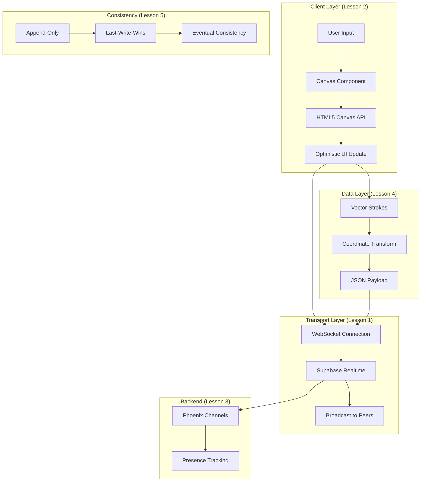

# Architecture Learning Module - UniBoard Lite

Welcome to the comprehensive architecture learning module for the UniBoard Lite collaborative whiteboard application. This module is designed for junior developers to understand the core concepts behind building real-time collaborative applications.

## 📚 Course Structure

This learning module consists of 5 lessons, each covering a critical aspect of real-time collaborative application architecture:

### [Lesson 1: Transport Layer](./01-transport-layer.md)
**Topics Covered:**
- WebSockets vs HTTP
- Pub/Sub (Publish/Subscribe) messaging pattern
- Stateless Relay architecture
- Supabase Realtime implementation
- Broadcast events and Presence tracking

**Key Takeaway:** Understanding how real-time bidirectional communication works and why we chose a stateless relay over traditional server architectures.

---

### [Lesson 2: Client Layer](./02-client-layer.md)
**Topics Covered:**
- HTML5 Canvas API fundamentals
- Raster vs Vector graphics
- The main rendering loop
- Optimistic UI pattern
- Mouse event handling and coordinate transformation
- Performance considerations

**Key Takeaway:** How the client renders graphics efficiently and provides instant feedback through optimistic UI updates.

---

### [Lesson 3: Backend Infrastructure](./03-backend-infrastructure.md)
**Topics Covered:**
- Custom WebSocket servers vs Platform-as-a-Service (PaaS)
- Supabase Realtime architecture
- Sticky sessions in distributed systems
- Scaling strategies (vertical vs horizontal)
- Cost comparison and decision matrix
- When to build custom vs use PaaS

**Key Takeaway:** Understanding the trade-offs between building custom infrastructure and using managed services.

---

### [Lesson 4: Data Structures](./04-data-structures.md)
**Topics Covered:**
- Vector vs Raster storage
- Stroke data structure design
- Coordinate systems and normalization
- Payload size analysis
- Compression techniques
- Memory management strategies

**Key Takeaway:** Why vector-based storage is 9,400× more efficient than raster for collaborative drawing applications.

---

### [Lesson 5: Distributed Consistency](./05-distributed-consistency.md)
**Topics Covered:**
- Distributed consistency challenges
- Last-Write-Wins (LWW) strategy
- Append-only architecture
- Introduction to CRDTs (Conflict-free Replicated Data Types)
- Operational Transforms (OT)
- Consistency vs Availability trade-offs

**Key Takeaway:** How to handle conflicts in distributed systems and why we chose simplicity over strong consistency.

---

## 🎯 Learning Path

### Recommended Order

1. **Start with Lesson 1** - Understand the foundation (transport layer)
2. **Move to Lesson 2** - Learn how the client renders and updates
3. **Study Lesson 3** - Understand infrastructure decisions
4. **Deep dive into Lesson 4** - Master data structures and optimization
5. **Complete with Lesson 5** - Understand distributed systems challenges

### Time Commitment

- **Each lesson:** 45-60 minutes
- **Total course:** 4-5 hours
- **Hands-on exercises:** +2-3 hours

---

## 🛠️ Hands-On Exercises

Each lesson includes code exercises. Here's how to approach them:

1. **Read the lesson** completely first
2. **Locate the code** examples in the actual codebase
3. **Implement the exercise** in a new branch
4. **Test your implementation** with multiple browser tabs
5. **Compare** with the lesson's solution

---

## 📊 Architecture Overview Diagram

---

## 🎓 Learning Outcomes

After completing this module, you will be able to:

- ✅ Explain how WebSockets enable real-time communication
- ✅ Implement optimistic UI for perceived performance
- ✅ Choose between custom servers and managed services
- ✅ Design efficient data structures for collaborative apps
- ✅ Handle conflicts in distributed systems
- ✅ Make informed architectural trade-offs
- ✅ Build your own real-time collaborative application

---

## 🔗 Related Resources

### Official Documentation
- [Supabase Realtime Docs](https://supabase.com/docs/guides/realtime)
- [MDN Canvas API](https://developer.mozilla.org/en-US/docs/Web/API/Canvas_API)
- [WebSocket Protocol](https://developer.mozilla.org/en-US/docs/Web/API/WebSockets_API)

### Advanced Topics
- [Yjs (CRDT Library)](https://docs.yjs.dev/)
- [Figma's Multiplayer Architecture](https://www.figma.com/blog/how-figmas-multiplayer-technology-works/)
- [Phoenix Framework](https://www.phoenixframework.org/)

### Books
- *Designing Data-Intensive Applications* by Martin Kleppmann
- *Building Microservices* by Sam Newman

---

## 💡 Tips for Success

1. **Run the app** while reading lessons to see concepts in action
2. **Open DevTools** to inspect network traffic and WebSocket messages
3. **Use multiple browser tabs** to simulate multiple users
4. **Experiment** with the code - break things and fix them
5. **Ask questions** - understanding "why" is more important than "how"

---

## 🚀 Next Steps

After completing this module:

1. **Build a feature** - Add a new tool (e.g., rectangle, circle)
2. **Optimize** - Implement one of the compression techniques from Lesson 4
3. **Scale** - Deploy to production and monitor performance
4. **Explore CRDTs** - Implement a simple CRDT for text collaboration
5. **Share** - Write a blog post about what you learned

---

## 📝 Feedback

This learning module is designed to be practical and hands-on. If you have questions or suggestions:

1. Review the code examples in the actual codebase
2. Try the exercises at the end of each lesson
3. Experiment with different approaches
4. Document your learnings

---

## 🏆 Challenge Project

**Build a collaborative TODO list** using the same architecture:

- **Transport:** Supabase Realtime
- **Client:** React + Optimistic UI
- **Data:** Append-only task list
- **Consistency:** Last-Write-Wins

Apply everything you learned in this module!

---

**Happy Learning! 🎉**

*Remember: The best way to learn architecture is to build, break, and rebuild.*
